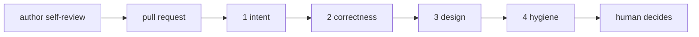

# code_review

[handbook](../readme.md) · prev: [prompt_library](prompt_library.md) · next: [parallel_agents](parallel_agents.md)

**In one sentence:** review is where AI pays best, because a wrong suggestion
costs nothing when a human decides.

The agent produces findings; the human approves. A finding without
`file:line` is not a finding. Drop-in version:
[code_review skill](../skills/code_review/SKILL.md).

## the pipeline



One prompt per pass. One prompt doing all four does all four badly.

## get the diff, any host

No hosting CLI needed — plain git covers everything:

```sh
git fetch origin main
git diff origin/main...HEAD > pr.diff     # three dots: from the merge base
git log origin/main..HEAD --oneline       # the commits
```

Or copy the raw diff from the browser:

- Bitbucket Cloud:
  `https://api.bitbucket.org/2.0/repositories/<workspace>/<repo>/pullrequests/<id>/diff`
  [api reference](https://developer.atlassian.com/cloud/bitbucket/rest/api-group-pullrequests/)
- Bitbucket Data Center:
  `https://<host>/rest/api/1.0/projects/<KEY>/repos/<repo>/pull-requests/<id>/diff?contextLines=1000`
  [api reference](https://developer.atlassian.com/server/bitbucket/rest/)
- GitHub without `gh`: append `.diff` to the pull request URL.

A failing build log pasted into the prompt beats any amount of speculation.

## author side, before opening the pull request

1. `git diff --stat` — over about 400 changed lines, split it.
2. Read your own diff first. Never send an agent diff you have not read.
3. Run the pass below and fix what it finds, so reviewers get a clean change.

```
Here is my diff: {{diff}}
You are a hostile reviewer on a C++ systems codebase.
Report only real defects, ranked by severity:
- undefined behaviour, lifetime and ownership bugs, aliasing, alignment
- data races, missing synchronization, invariants spanning several members
- error paths that leak or swallow failures
- breaks in the public interface or binary interface
- performance regressions in hot paths, hidden allocations, hidden copies
Ignore style. For each: file:line, why it is wrong, the smallest fix.
Say "none" for empty categories. Do not comment on code outside the diff.
```

## description

```
Diff: {{diff}}. Issue: {{issue_link}}.
Write a pull request description:
## what
2 to 4 bullets, at the level of behaviour.
## why
The problem in one paragraph, with the issue link.
## risk
What can break, and how far the damage reaches.
## verification
Exact commands run and their results; before and after numbers if performance.
No marketing, no emoji, no line-by-line retelling of the diff.
```

## reviewer side, four separate passes

| pass | question | model class |
| --- | --- | --- |
| 1. intent | does the change match the stated goal, and is that goal right | frontier reasoning |
| 2. correctness | undefined behaviour, lifetimes, races, error paths, edge cases | frontier reasoning, high effort |
| 3. design | is this the simplest shape, does it fit the codebase | frontier reasoning |
| 4. hygiene | naming, dead code, tests, documentation, style | fast mid-tier |

Pass 1:

```
Stated goal: {{goal}}. Diff: {{diff}}.
Answer three things only:
1. Does the change accomplish the goal? Where does it fall short?
2. Does it do anything beyond the goal? List extra scope with file:line.
3. Is the goal itself the right fix, or is it treating a symptom?
```

Pass 2 is the hostile-review prompt from the author side, run on their diff.
Pass 4 is a linter's job; a cheap model or `clang-tidy` handles it.

Pass 3:

```
Diff: {{diff}}. Surrounding code: {{context}}.
Judge the design:
- Could this be materially smaller? Show the smaller shape.
- Does it add an abstraction used exactly once? Name it.
- Does it duplicate something that already exists? Cite file:line.
- Does it match the conventions of this module?
Verdict: approve, approve with nits, or request changes, plus the single most
important change.
```

## triage of the queue

```
My open review requests: {{list}}
Rank by: blocking other people > small and mergeable > large and risky.
For each: estimated review time, the first thing to check, and whether a linter
could handle it instead of my attention.
```

## rules that keep this honest

- Reject "consider extracting a helper" noise.
- If two passes disagree, correctness wins.
- Batch reviews into two slots a day.
- On engine code, two extra gates come first: platform boundary and binary
  interface — the [tb_engine skill](../skills/tb_engine/SKILL.md).
